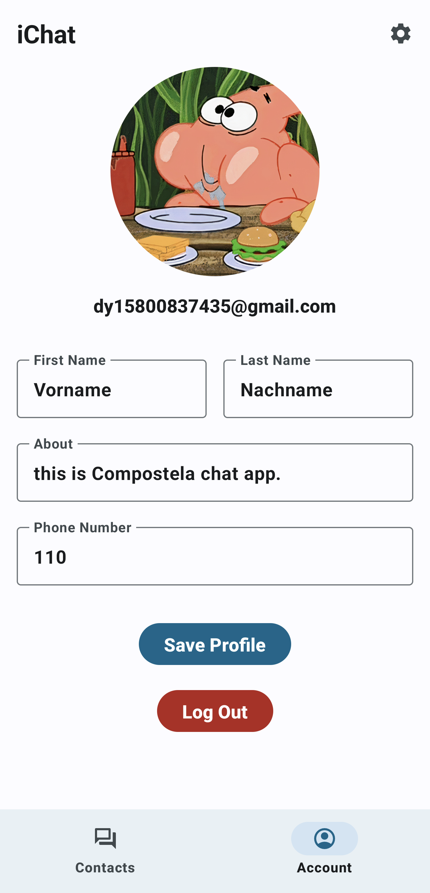

# ChatApp-Compose

Part of the design refers to [Jetchat](https://github.com/android/compose-samples/tree/main/Jetchat).

## :scroll: Description

This app is built entirely with [Jetpack Compose](https://developer.android.com/jetpack/compose), almost all UI elements are created by code.

This app uses firebase, so add your own google json file before building.

Download latest APK [here](https://github.com/YangDai2003/ChatApp-Compose/tree/master/app/release)

## :camera_flash: Screenshots

